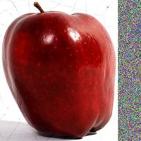
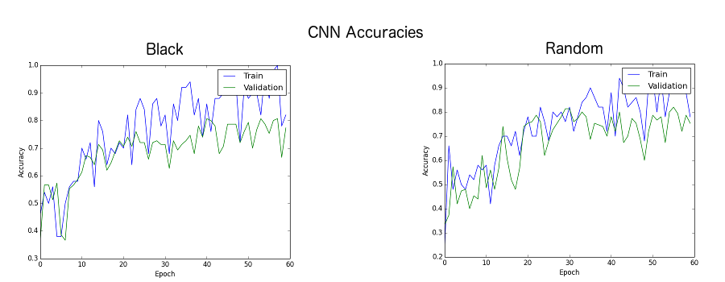
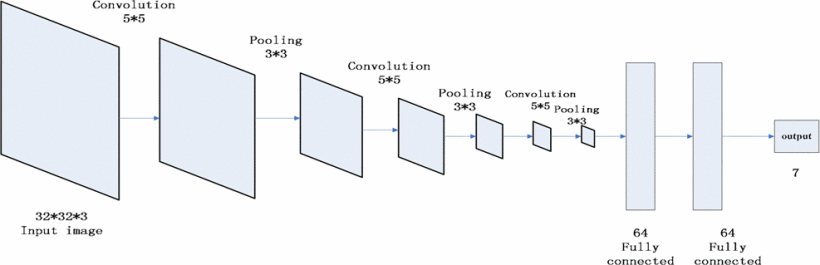
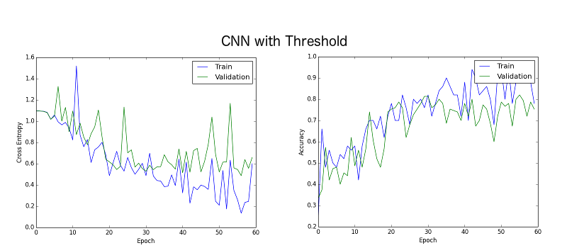
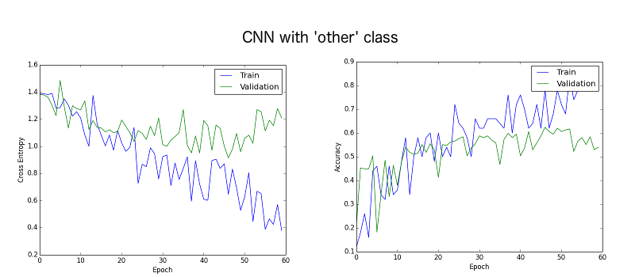
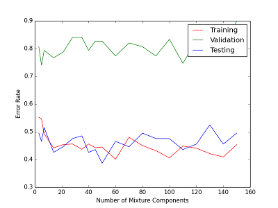
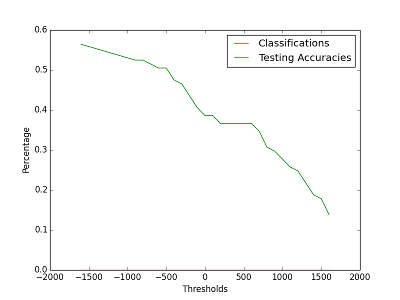

# Uncertainty in Image Classification (2017)
___

**Matthew Kim**

Undergraduate at University of Toronto

mtt.kim@mail.utoronto.ca

## 1. Introduction
A CNN classification model classifies its input images as one of N classes. They are trained to differentiate between a specific set of classes. For example, there could be a classification model that classifies images as either lemons or bananas. For self driving cars, there are models that classify different objects as pedestrians or vehicles. This paper explores the idea of having a model that reliably classify images that do not fall into any of the model's classes as 'uncertain'.

In a hierarchical classifier systems1 it may be desireable to be able to "reject" an image, pushing it back up the tree of classifiers, or to route it to another classifier.

To explore this idea we train three different models:

1. A convolutional neural network restricted to the three classes: apple, banana, and orange. It uses thresholds on the confidence of each class to determine uncertainty.
2. A convolutional neural network with four classes: apple, banana, orange, and 'other'. Classes not trained as inputs should be classified as 'other'.
3. A generative mixture of gaussians. It uses a threshold on the likelihood of each class to determine uncertainty.

I compare how well these models detect "uncertain" images.

## 1. Data

#### 1.1 Source
ImageNet's 2011 Fall Release

#### 1.2 Preprocessing
1. Crop the images according to their bounding boxes.
2. Pad the images in with pixels to make them square shaped.
3. Resize the image to 32x32x3 pixels.

#### 1.3 Black padding vs. random padding
As a little bonus experiment, I ran an identically structured convolutional neural network against the dataset using both random and black padding.

In the trial with black paddings (0s) the training set begins to overfit much faster than the in the trial with random paddings. Additionally, the validation accuracy has better results at a lower epoch than with the black padding.

This is because we want to try to prevent the neural network from learning irrelevant behaviors, like black boxes on sides of the image. If the values are completely random for each pixel then this would lower the chances of it learning the irrelevant pattern.

## 2. Experiments

#### 2.1 CNN with threshold

The CNN has three layers of convolution followed by max pooling and then two fully connected layers.

	
From Fruit Recognition based on convolutional neural network4

##### Performance

The CNN has been trained to classify apples, oranges, and bananas. It reached about a 75% accuracy rate on the validation set.

Threshold|Percent Uncertain
------|------
0.5| 10%
0.6| 10.67%
0.7| 10.67%
0.8| 11.33%
0.9| 11.33%

Using a dataset of mangoes, lemons, and chairs, I tested to see how many of these it would recognize as "uncertain" by using the threshold rule. A fruit will only be classified if its softmax value is greater than the threshold. Otherwise, it would be classified as "uncertain"

From a 0.5 threshold to 0.9 there is only a 1.33% increase in uncertain classifications. The entire dataset should be recognized as uncertain. This is not a very good result. We could raise the threshold even more, but then the CNN would start losing accuracy against actual apples, oranges, and bananas.

#### 2.2 CNN with 'other' class

For the next experiment, I used an identically structured convolutional neural network. Except, with four outputs. Now there is an 'other' class. The training data now has images of beans, berries, cherries, gourds, lemons, and lettuce all labelled as the fourth class. It must be tested against unseen fruits and objects for the "uncertain" items.

##### Performance

It averaged at about 55% accuracy in identifying apples, bananas, and oranges.

When the same dataset used to test the first model (lemons, mangoes, chairs), is run through the saved model it only classifies **8.06%** of the images as uncertain. This is not a very good result.

#### 2.3 Generative model

We finally use a mixture of gaussians method to classify fruits. The MoGs contain 45 components.

#### Performance

The classification rate plateaus at about 55% accuracy.

Using the same dataset as both the previous experiments of mangoes, lemons, and chairs we classify them using the MoGs. This is done by comparing the likelihoods of each class. If the greatest likelihood is under a certain threshold then it is classified as "uncertain".

The result is that for any threshold $\in$ [-1600,1600] it classifies the entire dataset as "uncertain". This is a desired result as the test data set is totally made up of those which should be classified as such. Their resulting likelihoods are almost all large negative numbers.

Here is a graph comparing the threshold and accuracies on the original fruits dataset. Too high of a threshold results in the mixture of gaussians being unable to identify true positives.

#### 4. Conclusion
The CNN with an 'other' class was only able to identify about 8.6% of uncertain cases.It didn't have the capacity to represent such a large variance of objects as a class. Rather, the 'other' class was trained to look for something similar to its trained images. This problem is somewhat of a "reverse-anomaly detection".

The most successful model was the generative model, mixture of gaussians. It successfully classified 100% of the uncertain images as uncertain cases. The statistical model has proven to be able to detect variances from underlying features of the trained classes successfully. However, the generative model was outperformed in accuracy by the ordinary convolutional neural network. 55% vs 75%.

The best model for this problem may be a combination of a neural network and mixture of gaussian.

This problem could be explored further by testing more models. A fourth model for discriminative models, using SVMs could be explored. It has been used in the past to classify fruits with an 88% accuracy2. Other discriminative models may be better for this specific fruit classification problem for the classification.

There are a some concepts which try to solve the problem of uncertainty like fuzzy methods. Fuzzy methods have been around since 19963. It may be interesting to compare the fuzzy methods with the generative model. However, the generative model's results on our uncertainty test were perfect with a 0 percent classification rate on uncertain inputs.

#### 3. Code

The code for the convolutional neural network and mixture of guassians are in the folders 'CNN' and 'MoG'.

There is also a lot of code to process the data which is in the data folder. I've not included the images because they are huge. If you'd like, you can download them from ImageNet's 2011 Fall Release. The code to generate the .npzs resulting from the images, 'process.py' is in the data folder.

#### References

1: Yanming Guo, Yu Liu, et al. "CNN-RNN: a large-scale hierarchical image classification framework" Open Access
2: Zhang, Y., & Wu, L. "Classification of fruits using computer vision and a multiclass support vector machine. Sensors", Open Access, Web. 1 Dec 2016
3: Cheng, Tao, Martien Molenaar, and Hui Lin. "Formalizing Fuzzy Objects from Uncertain Classification Results." International Journal of Geographical Information Science 15.1 (2001): 27-42. Web. 1 Dec. 2016
4: Lei Hou, QingXiang Wu, Qiyan Sun,  Heng Yang, Pengfei Li, "Fruit recognition based on convolution neural network", IEEE Access Code 16397890, Web. 1 Dec. 2016
5: Mrs.R.Shijitha, M.Anitha, B.Keerthiga, A.Manoranjitham, "Enhanced Technique for Fruit Sorting and Grading In Image Processing", International Journal of Research in Electronics, Web. 1 Dec. 2016